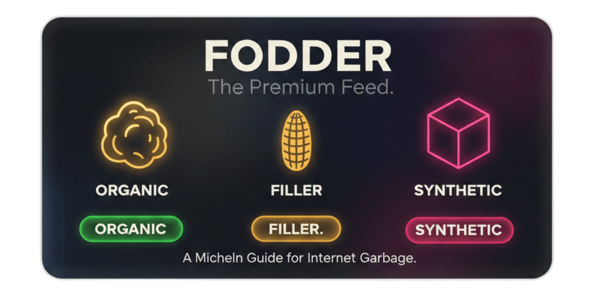

# FODDER

**The Lumina Update — A Chrome extension that scores YouTube videos 0-100 to surface expert content and filter AI slop.**

  
   
  <strong>Clinical analysis of YouTube content with adaptive Lumina aesthetics.</strong> 
  Using independent weighted mathematics to rate internet slurry with Apple-style precision.

---

## 🎯 What Is FODDER?

FODDER analyzes YouTube videos using a multi-factor weighted engine and presents findings through a **satirical, clinical lens** with an **Adaptive Lumina UI** that syncs with your YouTube theme.

### The "Sommelier" Tier System

- 🟢 **ORGANIC (70-100)** — "Certified Fresh." High signal, pure content.
- 🟡 **FILLER (40-69)** — "Edible." Processed, caloric but empty.
- 🔴 **SYNTHETIC (0-39)** — "Bio-Hazard." AI slop detected. DO NOT CONSUME.

---

## 🚀 The v3 "Lumina" Update

### 🎨 Visual & UX Overhaul
- **Floating Edge Dock**: The icon now floats borderless next to the score pill for a larger, high-definition presence without cluttering the UI.
- **Adaptive Lumina Theme**: Real-time syncing with YouTube’s internal theme. Light Mode features a frosted-glass "acrylic" material with high-contrast typography.
- **Ghost Watermarks**: Large, 25% opacity background watermarks in the Bento Box for immediate psychological recognition of content tiers.
- **Health Glow System**: Dynamic glows (Severe Red, Moderate Orange, Light Yellow, and Positive Green) highlight the specific metrics affecting the score.

### 📐 The Scoring Model (v3.0)

FODDER uses an independent weighted formula to calculate the **Humanity Score**:

$$composite = 0.45 \cdot DNA + 0.25 \cdot VEL + 0.20 \cdot INT + 0.10 \cdot VOL$$

#### Components
* **Approval DNA (45%)**: Bayesian sentiment rating calibrated to YouTube's 92-98% distribution.
* **Growth Velocity (25%)**: Performance momentum relative to the channel's subscriber base.
* **Signal Integrity (20%)**: Interaction density per view; our primary "bot and slop" detector.
* **Volume Magnitude (10%)**: Raw engagement weight (logarithmic scaling of total likes).

---

## 🔧 Installation

1. **Download/Clone** this repository.
2. **Load in Chrome:**
   - Navigate to `chrome://extensions/`
   - Enable **Developer Mode**
   - Click **Load unpacked** and select the folder.
3. **Icons**: Ensure `icon_organic.png`, `icon_filler.png`, and `icon_synthetic.png` (and their `_light` variants) are in the root directory.

---

## 📊 The "Sommelier" Voice

FODDER uses clinical, deadpan language to describe internet content:

### Organic (70-100)
**Verdict:** "Certified Fresh."  
**Detail:** "High signal, pure content detected. Safe for consumption."  

### Filler (40-69)
**Verdict:** "Edible."  
**Detail:** "Processed, caloric but empty. Contains common additives."  

### Synthetic (0-39)
**Verdict:** "Bio-Hazard."  
**Detail:** "AI slurry detected. Handle with extreme caution."  
**Warning:** "DO NOT CONSUME."

---

## 📄 License
MIT License — Built for researchers, educators, and those who demand better from their feed.

  <strong>FODDER v3.0 — "Adaptive. Clinical. Critical."</strong>

